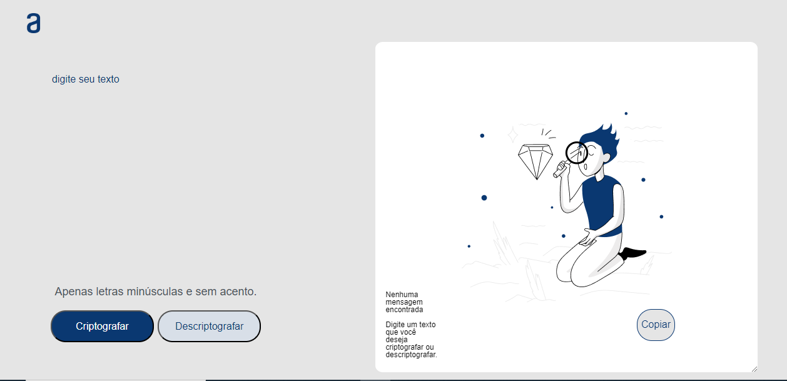
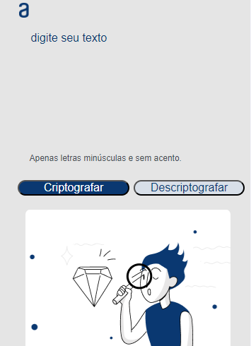

# 📝 Decodificador de Texto

## ✨ Descrição do Projeto

O **Decodificador de Texto** é uma aplicação web desenvolvida para permitir a conversão de textos entre uma forma codificada e sua forma original. Este projeto utiliza um conjunto específico de regras de substituição para transformar as vogais de uma string em sequências de caracteres distintas, tornando o texto mais divertido e desafiador para ler. É uma excelente ferramenta para praticar conceitos de programação, manipulação de strings e lógica de algoritmos.

### 🚀 Funcionalidades

- **Codificação**: Transforma a string original em uma versão codificada com substituições específicas.
- **Decodificação**: Permite reverter a string codificada de volta à sua forma original, facilitando o entendimento do texto original.
- **Interface Intuitiva**: A interface do usuário é projetada para ser simples e fácil de usar, proporcionando uma experiência agradável.

### 🔍 Exemplo de Uso

Para entender como a aplicação funciona, considere os seguintes exemplos:

- A string `"laysa"` se transforma em `"laiysai"` (codificação).
- A string `"laiysai"` é revertida para `"laysa"` (decodificação).

### 📜 Regras de Codificação

As seguintes regras são aplicadas ao texto:

- A letra **"e"** é convertida para **"enter"**.
- A letra **"i"** é convertida para **"imes"**.
- A letra **"a"** é convertida para **"ai"**.
- A letra **"o"** é convertida para **"ober"**.
- A letra **"u"** é convertida para **"ufat"**.

### 🖱️ Como Usar

Para utilizar o descodificador de texto, [clique aqui](https://laysabernardes.github.io/Decodificador-Alura-One/).

### 📸 Capturas de Tela

- 
- 
